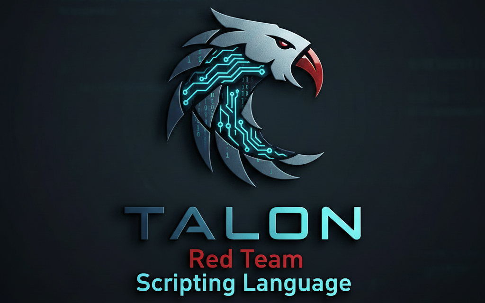

<!--
TALON DSL: research-oriented exploit development language,
binary analysis scripting, reproducible exploitation framework,
compiled DSL for offensive security research, reverse engineering automation,
kernel exploit prototyping, smart contract auditing language
-->
<!-- TALON scripting language, TALON DSL, offensive security scripting language, exploit development language, exploit centric DSL, security native programming language, hacking DSL, red team scripting language, CTF scripting language, exploit automation language, binary exploitation DSL, pwn scripting language, reverse engineering DSL, exploit compiler, exploit interpreter, domain specific language for hacking, English like exploit language, human readable exploit scripting, native exploit compilation, Rust LLVM exploit compiler, LLVM based exploit language, native code exploit generation, shellcode generation language, ROP scripting language, return oriented programming DSL, heap exploitation language, kernel exploitation scripting, Windows exploitation DSL, Linux exploitation DSL, format string exploitation language, automatic offset discovery, GDB assisted exploitation, libc database integration, libc.rip integration, exploit template engine, interactive exploit helpers, quick exploit prototyping, CTF automation tooling, red team lab tooling, adversarial research language, security research DSL, exploit research platform, binary analysis tooling, ELF analysis, PE analysis, Mach-O analysis, integrated disassembler helpers, fuzzing language, binary fuzzing DSL, kernel fuzzing research, exploit fuzzing automation, vulnerability research language, exploit chain modeling, post exploitation scripting, lateral movement research tooling, privilege escalation research, kernel CVE exploitation framework, exploit proof of concept language, exploit PoC automation, exploit scaffolding language, modular standard library, security focused standard library, plugin based exploit framework, extensible exploit language, native Rust plugin system, dynamic module loading, exploit module framework, IDE assisted exploitation, VS Code exploit extension, exploit debugger integration, visual exploit tooling, interactive REPL exploitation, exploit REPL environment, command line exploit tooling, cross platform exploit language, Windows Linux exploit tooling, offensive security compiler, red team engineering toolkit, exploit engineering platform, CTF competition tooling, alpha stage exploit language, experimental exploit DSL, research only offensive tooling, ethical security research language -->

# TALON - Scripting Language for Offensive Security



TALON is a security native, exploit centric, English like domain specific language designed for exploit developers, CTF competitors, red teamers, reverse engineers, and security researchers.

This repository contains the TALON compiler, interpreter, standard library, exploit tooling, plugin system, and IDE integrations.

> **ALPHA NOTICE**: TALON is under **active development**. Expect breaking changes, experimental syntax, and rapid iteration. Not yet production-safe. Ideal for CTF competitions, red team labs, research, or prototyping offensive techniques.


[](https://codecov.io/gh/ridpath/talon)


---

## Key Capabilities

- Human-readable exploit DSL
- Native compilation via Rust/LLVM
- Built-in exploitation primitives (ROP, heap, kernel, format strings)
- Libc database integration (libc.rip)
- Automatic buffer overflow offset discovery (GDB)
- Exploit templates and interactive quick helpers
- Integrated binary analysis (ELF, PE, Mach-O)
- Modular standard library (138+ modules)
- Plugin system (TALON modules + native Rust plugins)
- VS Code IDE extension with debugger and visual tools

---

## Installation

### Prerequisites

#### Linux (Ubuntu/Debian)
```bash
# Install Rust toolchain
curl --proto '=https' --tlsv1.2 -sSf https://sh.rustup.rs | sh
source $HOME/.cargo/env

# Install build essentials (required for linking)
sudo apt-get update
sudo apt-get install build-essential pkg-config libssl-dev
```

#### Linux (Fedora/RHEL/CentOS)
```bash
# Install Rust toolchain
curl --proto '=https' --tlsv1.2 -sSf https://sh.rustup.rs | sh
source $HOME/.cargo/env

# Install development tools
sudo dnf groupinstall "Development Tools"
sudo dnf install openssl-devel pkg-config
```

#### macOS
```bash
# Install Rust toolchain
curl --proto '=https' --tlsv1.2 -sSf https://sh.rustup.rs | sh
source $HOME/.cargo/env

# Install Xcode Command Line Tools (if not already installed)
xcode-select --install
```

#### Windows

**Option 1: Using winget (Windows 10/11)**
```powershell
# Install Rust
winget install Rustlang.Rustup

# Install Visual Studio Build Tools (required for linking)
winget install Microsoft.VisualStudio.2022.BuildTools --override "--quiet --wait --add Microsoft.VisualStudio.Workload.VCTools --includeRecommended"

# Restart terminal to refresh PATH
```

**Option 2: Manual Installation**
1. Download and install Rust from https://rustup.rs
2. Download and install Visual Studio Build Tools: https://visualstudio.microsoft.com/downloads/#build-tools-for-visual-studio-2022
   - Select "Desktop development with C++" workload
3. Restart your terminal

**Option 3: Using MinGW (alternative to MSVC)**
```powershell
# Download MinGW-w64 from: https://github.com/niXman/mingw-builds-binaries/releases
# Extract to C:\mingw64 and add C:\mingw64\bin to PATH

# Then configure Rust to use GNU toolchain:
rustup default stable-x86_64-pc-windows-gnu
```

### Build from Source

#### Linux/macOS
```bash
git clone https://github.com/ridpath/talon.git
cd talon
cargo build --release
./target/release/talon --version
./target/release/talon repl
```

#### Windows (PowerShell)
```powershell
git clone https://github.com/ridpath/talon.git
cd talon
cargo build --release
.\target\release\talon.exe --version
.\target\release\talon.exe repl
```

#### Windows (CMD)
```cmd
git clone https://github.com/ridpath/talon.git
cd talon
cargo build --release
target\release\talon.exe --version
target\release\talon.exe repl
```

### Quick Install (All Platforms)

After installing prerequisites above:
```bash
# Linux/macOS
cargo install --path .

# Windows
cargo install --path .

# Then run from anywhere:
talon --version
talon repl
```

---

## Core CLI Commands

```bash
talon run <script.talon>
talon build <script.talon>
talon repl
talon analyze <binary>
talon fuzz <binary>
talon kernel exploit <CVE-ID>
talon audit <contract.sol>
talon web scan <url>
talon template <name> <args>
```

---

## Interactive Helpers

```talon
quick_shell("host", port)
quick_rop("./binary")
quick_pwn("./binary", "host", port)
quick_heap()
quick_fmt()
```

---

## Plugin System

### Custom TALON Modules

```talon
define function my_helper(arg)
    print(arg)
end
```

### Native Rust Plugins

```talon
load_plugin("plugins/my_plugin.so")
```

---

## VS Code Extension

See `README.md in vscode-extensions directory` for IDE features, debugging, and visual tools.

---

## Testing & Quality Assurance

TALON maintains **world-class quality** through comprehensive testing infrastructure covering unit tests, integration tests, fuzzing, benchmarking, and continuous integration.

### Quick Test Commands

```bash
# Run all tests
cargo test --all-features

# Run specific test categories
cargo test --test parser_test          # Parser tests
cargo test --test rop_test             # ROP exploitation tests
cargo test --test heap_test            # Heap exploitation tests
cargo test --test exploit_chain_test   # Multi-stage exploit chains

# Run with output
cargo test --all-features -- --nocapture

# Run tests matching a pattern
cargo test heap_                       # All heap-related tests
cargo test format_string              # Format string tests
```

### Test Organization

**Unit Tests** (`tests/unit/`):
- Parser and AST (`parser_test.rs`, `ast_test.rs`)
- Binary analysis (`binary_analysis_test.rs`)
- Exploitation modules (`rop_test.rs`, `heap_test.rs`, `shellcode_test.rs`)
- Packing/encoding (`packing_test.rs`, `encoding_test.rs`, `cyclic_test.rs`)
- Format strings (`format_string_test.rs`)
- LSP server (`lsp_test.rs`)

**Integration Tests** (`tests/integration/`):
- Standard library coverage (`stdlib/` - 163 tests across 12 categories)
- Multi-stage exploit chains (`exploit_chain_test.rs` - 30 comprehensive scenarios)
- LSP/IDE integration (`lsp_integration_test.rs` - 110+ protocol tests)
- Example script validation (`example_runner_test.rs`)

### Code Coverage

```bash
# Install coverage tool
cargo install cargo-tarpaulin

# Generate HTML coverage report
cargo tarpaulin --out Html --all-features

# Generate and upload to Codecov
./scripts/generate_coverage.sh         # Linux/macOS
.\scripts\generate_coverage.ps1        # Windows
```

**Coverage Targets**:
- Overall: >80%
- Parser: >95%
- Exploitation modules: >90%
- Standard library: >80%

See **`docs/COVERAGE.md`** for detailed coverage analysis.

### Fuzzing

TALON includes comprehensive fuzzing infrastructure using cargo-fuzz (libFuzzer):

```bash
# Quick fuzzing (5 minutes per target)
./scripts/run_fuzz.sh 300              # Linux/macOS
.\scripts\run_fuzz.ps1 -Duration 300   # Windows

# Run specific fuzz target
cargo +nightly fuzz run fuzz_parser -- -max_total_time=600

# Run with existing corpus
cargo +nightly fuzz run fuzz_elf_parser corpus/elf/
```

**Fuzz Targets** (10 comprehensive targets):
- `fuzz_parser` - TALON DSL syntax fuzzing
- `fuzz_elf_parser` - ELF binary format fuzzing
- `fuzz_pe_parser` - PE binary format fuzzing
- `fuzz_shellcode` - Shellcode generation fuzzing
- `fuzz_format_string` - Format string exploit fuzzing
- `fuzz_heap_tools` - Heap manipulation fuzzing
- `fuzz_rop_finder` - ROP gadget finder fuzzing
- `fuzz_packing` - Packing/encoding fuzzing
- `fuzz_interpreter` - Interpreter execution fuzzing
- `fuzz_exploit_chain` - Multi-stage exploit fuzzing

See **`docs/FUZZING.md`** for complete fuzzing documentation.

### Performance Benchmarking

```bash
# Run all benchmarks
cargo bench

# Run specific benchmark suite
cargo bench parser                     # Parser benchmarks
cargo bench interpreter                # Interpreter benchmarks
cargo bench rop                        # ROP tools benchmarks
cargo bench binary_analysis            # Binary analysis benchmarks

# Run benchmark scripts
./scripts/run_benchmarks.sh            # Linux/macOS
.\scripts\run_benchmarks.ps1           # Windows
```

**Benchmark Suites** (91 benchmark functions):
- Parser (24 benchmarks) - Expression parsing, statement parsing, error recovery
- Interpreter (25 benchmarks) - Variables, control flow, functions, exploitation
- Binary analysis (24 benchmarks) - ELF parsing, disassembly, patching
- ROP tools (18 benchmarks) - Gadget search, chain building, auto solver

See **`docs/BENCHMARKING.md`** for performance analysis and optimization guidelines.

### Security Auditing

```bash
# Run security audit
cargo audit

# Run license and dependency checks
cargo deny check

# Run comprehensive security audit
./scripts/security_audit.sh            # Linux/macOS
.\scripts\security_audit.ps1           # Windows
```

**Security Infrastructure**:
- Daily dependency vulnerability scanning (GitHub Actions)
- Automated Dependabot updates
- Cargo-deny for license and security policy enforcement
- Security policy documentation (`SECURITY.md`)

See **`docs/SECURITY_AUDITING.md`** for security audit procedures.

### Continuous Integration

All commits are automatically tested via **GitHub Actions**:

**`.github/workflows/ci.yml`**:
- ✅ Build on Linux and Windows
- ✅ Full test suite execution
- ✅ Code coverage generation
- ✅ Coverage upload to Codecov
- ✅ Clippy linting
- ✅ Format checking

**`.github/workflows/security.yml`**:
- ✅ Cargo-audit vulnerability scanning
- ✅ Cargo-deny policy enforcement
- ✅ Daily scheduled security checks

**`.github/workflows/fuzzing.yml`**:
- ✅ Daily fuzzing campaigns (1hr per target)
- ✅ Corpus artifact preservation
- ✅ Crash report generation

**`.github/workflows/benchmarks.yml`**:
- ✅ Performance regression detection
- ✅ Benchmark result archiving
- ✅ Performance trend tracking

### Quality Metrics

| Metric | Target | Current Status |
|--------|--------|----------------|
| Test Coverage | >80% | [](https://codecov.io/gh/ridpath/talon) |
| Build Status | Passing | [](https://github.com/ridpath/talon/actions/workflows/ci.yml) |
| Security Audit | No Critical | [](https://github.com/ridpath/talon/actions/workflows/security.yml) |
| Fuzz Stability | No Crashes | Daily fuzzing (10 targets) |

### Testing Documentation

- **`TESTING.md`** - Comprehensive testing guide
- **`CONTRIBUTING.md`** - Contributor guidelines with testing requirements
- **`docs/FUZZING.md`** - Fuzzing infrastructure documentation
- **`docs/BENCHMARKING.md`** - Performance benchmarking guide
- **`docs/COVERAGE.md`** - Code coverage analysis
- **`docs/SECURITY_AUDITING.md`** - Security audit procedures
- **`docs/QA_CHECKLIST.md`** - Manual QA testing checklist
- **`docs/MANUAL_TESTING.md`** - Manual testing procedures

---

## License

MIT License

## CTF Quick Start

New to TALON? Check out our **CTF Quickstart Guide**:

```bash
# See comprehensive CTF patterns and workflows
cat docs/CTF_QUICKSTART.md
```

### Example CTF Exploits

Real-world exploitation examples in `examples/`:

**Binary Exploitation**:
- `ctf_ret2libc_pwn.talon` - Standard ret2libc exploitation
- `ctf_one_gadget_pwn.talon` - One-gadget RCE
- `ctf_multi_stage_pwn.talon` - Multi-stage exploitation with leak, canary bypass, and final shell
- `ctf_blind_rop.talon` - Blind ROP when binary is unavailable

**Format String**:
- `ctf_format_string_leak_write.talon` - Advanced format string with leak and arbitrary write

**Heap Exploitation**:
- `ctf_heap_tcache_poison.talon` - Modern tcache poisoning attack

**Shellcode**:
- `ctf_shellcode_encoder.talon` - Badchar bypass with multiple encoding strategies

**Kernel**:
- `ctf_kernel_exploit.talon` - Kernel exploitation template (modprobe_path, cred overwrite)

### Helper Libraries

Import pre-built helpers:

```talon
include "stdlib/ctf_helpers.talon"

# Use helper functions
let libc_base = calc_libc_base(leak, 0x21b10)
let addrs = build_ret2libc_chain(libc_base, false)
let offset = find_fmt_offset(conn, 0x41414141)
```

## Built-in Functions Reference

A short quick-reference is included in this repo:

- `BUILTIN_FUNCTIONS_REFERENCE.md` - Quick reference for core language helpers (collections, conversion, file I/O, packing/unpacking, and common utilities)
- `docs/CTF_QUICKSTART.md` - Comprehensive CTF exploitation guide with patterns and workflows

For the full catalog (exploitation, analysis, fuzzing, kernel, web, blockchain, forensics, templates, and helpers), see the "Built-in Functions" section in this README and the in-tool docs:

- `talon repl` then `help()` or `help(search: "keyword")`
- `man talon` and `man talon-<topic>`


<!--
TALON DSL: CTF exploitation language, competitive hacking framework,
ret2libc automation, format string exploitation, heap exploitation toolkit,
GDB-assisted offset discovery, libc identification via leaks,
CTFd and Hack The Box workflow tooling, exploit templates for competitions
-->
